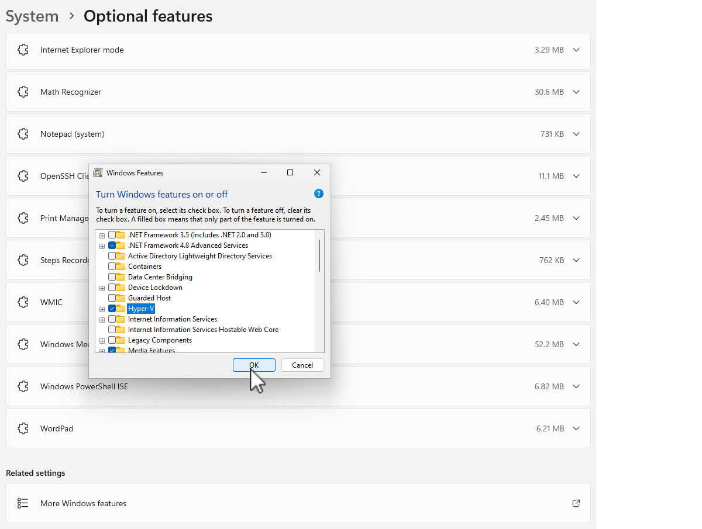
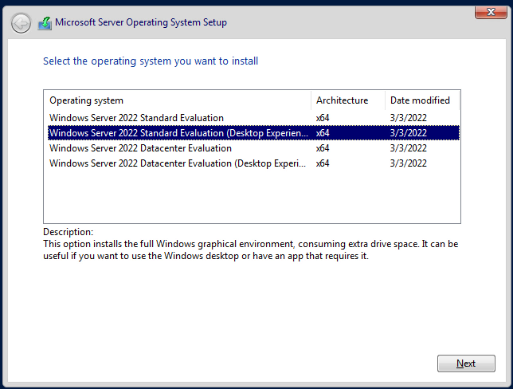

---
lab:
  title: Préparer
  module: Guided Project – Administer Active Directory Domain Services
---
## Vue d'ensemble du projet

Dans ce projet guidé, vous parcourez les principales étapes de création, de configuration et de maintenance d’un contrôleur de domaine. Vous avez également la possibilité de promouvoir un contrôleur de domaine.

## Programme d’installation

Pour réduire les exigences d’accès aux ressources (par exemple, l’accès à Windows Server ou à un abonnement Microsoft Azure), ce projet guidé utilise une machine Windows 10 ou Windows 11 pour exécuter un environnement virtualisé. Vous configurez un sous-système Hyper-V d’un ordinateur Windows 10 ou Windows 11 pour prendre en charge les deux machines virtuelles Windows Server 2022 Evaluation Edition que vous utilisez dans ce projet. Vous avez besoin de l’édition Professionnel ou Entreprise de Windows 10 ou Windows 11 pour effectuer ces tâches.

L’ordinateur qui fonctionne comme hôte de virtualisation Hyper-V doit avoir au moins 16 Go de RAM. Vous pouvez également utiliser une version d’évaluation de Windows Server avec le rôle Hyper-V installé en tant qu’hôte pour ces machines virtuelles, ou pour configurer une plateforme de virtualisation tierce pour héberger les deux machines virtuelles. Les exercices et les tâches de ce labo utilisent Windows 11 lors de la description de l’hôte Hyper-V. Les options présentées ici facilitent la localisation des fichiers de machines virtuelles volumineux si vous souhaitez supprimer la configuration une fois le projet terminé.

La section Configuration se compose de trois tâches principales :

 -  Installer Hyper-V
 -  Créer une machine virtuelle de contrôleur de domaine Windows Server
 -  Créer un serveur membre de domaine Windows Server

## Installer Hyper-V

Dans cette tâche, vous allez installer Hyper-V et configurer un commutateur NAT. Vous allez configurer Hyper-V pour utiliser un autre ensemble de répertoires par défaut pour stocker des fichiers de machine virtuelle et des disques durs. Vous pouvez utiliser les options présentées dans ces instructions ou choisir votre propre emplacement.

1.  Connectez-vous à l’ordinateur sous Windows 11 avec un compte disposant des privilèges d’administrateur local.
2.  Sur l’ordinateur sous Windows 11, cliquez sur **Démarrer**, sélectionnez **Paramètres**, puis, dans la page Paramètres, sélectionnez **Système**.
3.  Dans la page Système des Paramètres, faites défiler jusqu’à Fonctionnalités facultatives. Sélectionnez **Fonctionnalités facultatives**.
4.  Dans la page Fonctionnalités facultatives, faites défiler jusqu’à **Plus de fonctionnalités Windows** dans Paramètres associés.
5.  Dans la page Fonctionnalité de Windows, cochez la case en regard d’Hyper-V, puis cliquez sur **OK**, comme indiqué dans l’exemple.
    
    
    
6.  Une fois l’installation terminée, dans la page Fonctionnalités de Windows, cliquez sur **Redémarrer maintenant**.
7.  Après le redémarrage de l’ordinateur, connectez-vous à l’aide du même compte (celui disposant des privilèges d’administration locaux).
8.  Cliquez sur **Démarrer** et recherchez Gestionnaire Hyper-V. Épinglez le Gestionnaire Hyper-V à la barre des tâches.
9.  Ouvrez le Gestionnaire Hyper-V, cliquez avec le bouton droit sur la machine virtuelle, puis sélectionnez **Paramètres Hyper-V**.
10. Dans la boîte de dialogue **Paramètres Hyper-V**, dans Serveur, sélectionnez **Machines virtuelles**. Définissez l’emplacement du dossier Machines virtuelles sur C :\\VirtualMachines.
11. Dans la boîte de dialogue **Paramètres Hyper-V**, dans Serveur, sélectionnez **Disques durs de machine virtuelle**. Définissez l’emplacement des disques durs de machine virtuelle sur C:\\VirtualMachines\\VHDs.
12. Cliquez sur **OK** pour fermer la boîte de dialogue **Paramètres**.
13. Ouvrez une invite de commandes d’administration et exécutez les commandes suivantes pour créer un réseau NAT. `New-VMSwitch -SwitchName “NATSwitch” -SwitchType Internal` `New-NetIPAddress -IPAddress 10.10.10.1 -PrefixLength 24 -InterfaceAlias “vEthernet (NATSwitch)”` `New-NetNat -Name “NATNetwork” –InternalIPInterfaceAddressPrefix “10.10.10.0/24”`
14. Fermez l’invite de commandes d’administration.

## Créer une machine virtuelle de contrôleur de domaine Windows Server

Dans cette tâche, vous allez déployer et configurer un contrôleur de domaine Windows Server 2022 pour le labo dans lequel vous effectuez des tâches liées au titre de compétence appliquée. Pour effectuer cette tâche, vérifiez que vous avez téléchargé le fichier ISO de l’édition d’évaluation Windows Server 2022 à partir de [https://www.microsoft.com/en-us/evalcenter/download-windows-server-2022](https://www.microsoft.com/en-us/evalcenter/download-windows-server-2022). Placez ce fichier dans le dossier C:\\ISOs. Ce fichier ISO d’évaluation vous permet d’exécuter une version complète de Windows Server 2022 pendant 180 jours.

1.  Dans le Gestionnaire Hyper-V, dans le menu **Actions**, sélectionnez **Nouveau**, puis **Machine virtuelle**.
2.  Dans la page Avant de commencer de l’assistant Nouvelle machine virtuelle, cliquez sur **Suivant**.
3.  Dans la page Spécifier le nom et l’emplacement de l’assistant Nouvelle machine virtuelle, tapez le nom **TAILWIND-DC1**, puis cliquez sur **Suivant**.
4.  Dans la page Spécifier la génération, sélectionnez **Génération 2**, puis cliquez sur **Suivant**.
5.  Dans la page Affecter la mémoire, définissez la mémoire de démarrage sur 4096 Mo et laissez la case **Utiliser la mémoire dynamique pour cette machine virtuelle** cochée. Sélectionnez **Suivant**.
6.  Dans la page Configurer la mise en réseau, définissez la connexion dans le menu déroulant sur NATSwitch, puis cliquez sur **Suivant**.
7.  Dans la page Connecter un disque dur virtuel, acceptez les valeurs par défaut, puis cliquez sur **Suivant**.
8.  Dans la page Options d’installation, sélectionnez l’option **Installer un système d’exploitation à partir d’un fichier image de démarrage**, puis cliquez sur **Parcourir** pour sélectionner le fichier ISO de l’édition d’évaluation Windows Server 2022 (nommé SERVER\_EVAL\_x64FRE\_en-us.iso). Vous avez déjà téléchargé ce fichier dans le dossier C:\\ISOs. Sélectionnez **Suivant**.
9.  Sur la page Résumé, cliquez sur **Terminer**.
10. Dans le Gestionnaire Hyper-V, cliquez avec le bouton droit sur TAILWIND-DC1, puis sélectionnez **Paramètres**.
11. Dans la page Paramètres TAILWIND-DC1, dans Gestion, sélectionnez **Points de contrôle** et vérifiez que la case **Utiliser des points de contrôle automatiques** est décochée, comme indiqué dans la capture d’écran. Cliquez sur **OK**.
    
    
12. Double-cliquez sur TAILWIND-DC1. La fenêtre Connexion à une machine virtuelle s’ouvre. Sélectionnez **Démarrer**. Lorsque le message Appuyez sur une touche pour démarrer à partir d’un CD ou DVD s’affiche, utilisez la souris pour sélectionner à l’intérieur de la fenêtre de la machine virtuelle, puis appuyez sur la barre d’espace. Cela permet à la machine virtuelle de démarrer à partir du fichier ISO joint.
13. Dans la page Installation du système d’exploitation Microsoft Server, acceptez les valeurs par défaut, puis cliquez sur **Suivant**.
14. Dans la page Installer maintenant, sélectionnez **Installer maintenant**.
15. Dans la page Installation du système d’exploitation Microsoft Server, sélectionnez **Évaluation standard de Windows Server 2022 (expérience utilisateur),** comme illustré dans la capture d’écran, puis cliquez sur **Suivant**.
    
    
    
17. Dans la page Avis applicables et termes du contrat de licence applicables, passez en revue la licence, cochez la case **J’accepte**. Sélectionnez **Suivant**.
18. Dans la page « Quel type d’installation voulez-vous effectuer ? », sélectionnez **Personnalisé**.
19. Dans la page « Où voulez-vous installer le système d’exploitation ? », sélectionnez Lecteur 0, puis cliquez sur **Suivant**. Le système d’exploitation s’installe. Cela prend plusieurs minutes en fonction de la vitesse de l’ordinateur que vous utilisez. La machine virtuelle redémarre.
20. Dans la page Personnaliser les paramètres, vous devez fournir un mot de passe pour le compte Administrateur intégré. Entrez le mot de passe **Pa55w.rdPa55w.rd**. Le mot de passe est un mot de passe de démonstration et ne doit pas être utilisé sur les systèmes de production. Vous pouvez également choisir votre propre mot de passe ici. Une fois que vous avez entré le mot de passe administrateur deux fois, cliquez sur **Terminer**. Vous ne serez pas connecté à la machine virtuelle en cours d’exécution.
21. Dans l’écran de verrouillage de la machine virtuelle, entrez le mot de passe administrateur **Pa55w.rdPa55w.rd** pour vous connecter.
22. Une fois connecté, cliquez avec le bouton droit sur l’icône réseau, représentée par un globe dans la barre des tâches, puis sélectionnez **Ouvrir les paramètres réseau et Internet**.
23. Dans la page Statut du réseau, sélectionnez **Modifier les options d’adaptateur**.
24. Dans la page Connexions réseau, cliquez avec le bouton droit sur **Ethernet** et sélectionnez **Propriétés**.
25. Dans la page Propriétés Ethernet, sélectionnez l’élément Protocole Internet version 4 (TCP/IPv4), puis cliquez sur le bouton **Propriétés**.
26. Dans l’onglet Général de la page Propriétés du protocole Internet version 4 (TCP/IPv4), définissez la configuration de l’adresse IP comme suit, puis cliquez sur **OK** :
    
    
    1.  Utiliser l’adresse IP suivante :
        
        
        1.  Adresse IP : 10.10.10.10
        2.  Masque de sous-réseau : 255.255.255.0
        3.  Passerelle par défaut : 10.10.10.1
    2.  Utiliser l’adresse de serveur DNS suivante :
        
        
        1.  Serveur DNS préféré : 1.1.1.1
        2.  Serveur DNS auxiliaire : 8.8.8.8
27. Cliquez sur **Fermer**. Lorsque l’on vous demande si vous souhaitez autoriser l’ordinateur à être détectable, sélectionnez **Oui**.
28. Dans le menu Démarrer, ouvrez Gestionnaire de serveur, sélectionnez Serveur local, puis le nom de l’ordinateur. La boîte de dialogue Propriétés système s’ouvre. Dans la boîte de dialogue Propriétés système, sur la page Nom de l’ordinateur, cliquez sur **Modifier**.
29. Dans la boîte de dialogue Modifications de nom d’ordinateur/domaine, définissez le nom de l’ordinateur sur **TAILWIND-DC1**, puis cliquez sur **OK**. 
30. Dans la boîte de dialogue vous informant que vous devez redémarrer votre ordinateur, cliquez sur **OK**.
31. Dans la boîte de dialogue Propriétés système, sélectionnez **Fermer**.
32. Dans la boîte de dialogue **Vous devez redémarrer votre ordinateur pour appliquer ces modifications**, cliquez sur **Redémarrer maintenant**. L'ordinateur redémarre.
33. Lorsque l’ordinateur a redémarré, connectez-vous en tant qu’administrateur avec le mot de passe que vous avez configuré lors de l’installation.
34. Dans le Gestionnaire de serveur, sélectionnez le menu Gérer, puis **Ajouter des rôles et des fonctionnalités**.
35. Dans la page Avant de commencer de l’assistant Ajouter des rôles et des fonctionnalités, sélectionnez **Suivant**.
36. Sur la page Sélectionner le type d’installation, sélectionnez **Installation basée sur un rôle ou une fonctionnalité**, et cliquez sur **Suivant**.
37. Dans la page Sélectionner le serveur de destination, cliquez sur **Sélectionner un serveur du pool de serveurs**, vérifiez que **TAILWIND-DC1** est sélectionné, puis cliquez sur **Suivant**.
38. Dans la page Sélectionner des rôles de serveurs, cochez la case **Services de domaine Active Directory**. La page Ajouter des fonctionnalités s’ouvre. Sélectionnez **Ajouter des fonctionnalités**. Dans la page Sélectionner des rôles de serveurs, cliquez sur **Suivant**
39. Dans la page Sélectionner des fonctionnalités, cliquez sur **Suivant**.
40. Dans la page Services de domaine Active Directory, puis cliquez sur **Suivant**.
41. Dans la page Confirmer les sélections pour l’installation, sélectionnez **Installer**. Selon la vitesse de l’ordinateur, l’installation peut prendre plusieurs minutes. Une fois l’installation terminée, cliquez sur **Fermer**.
42. Dans le menu Gestionnaire de serveur, sélectionnez l’icône de notification en regard du drapeau dans le coin supérieur droit, comme indiqué dans la capture d’écran.

    
43. Dans le menu qui s’ouvre lorsque vous sélectionnez l’icône de notification, sélectionnez **Promouvoir ce serveur en contrôleur de domaine**. L’assistant Configuration des services de domaine Active Directory est lancé.
44. Dans la page Configuration du déploiement, sélectionnez **Ajouter une nouvelle forêt** et définissez le nom de domaine racine sur **tailwind runtimes.internal**. Sélectionnez **Suivant**.
45. Dans la page Options de contrôleur de domaine, acceptez les paramètres par défaut et fournissez un mot de passe en mode de restauration des services d’annuaire (DSRM). Pour ce faire, entrez le mot de passe suivant deux fois : Pa55w.rdPa55w.rd. Sélectionnez **Suivant**.
46. Dans la page Options DNS, cliquez sur **Suivant**.
47. Dans la page Options supplémentaires, cliquez sur **Suivant**.
48. Dans la page Chemins d’accès, cliquez sur **Suivant**.
49. Dans la page Examiner les options de, cliquez sur **Suivant**
50. Sur la page Vérification des conditions requises , cliquez sur **Installer**. L’installation prend plusieurs minutes en fonction de la vitesse de la machine virtuelle. La machine virtuelle redémarre.
51. Lorsque la machine virtuelle redémarre, connectez-vous en tant que **tailwindtraders\\administrateurr**avec le mot de passe que vous avez configuré pour le compte administrateur par défaut (Pa55w.rdPa55w.rd)

## Créer un serveur membre de domaine Windows Server

Dans cette tâche, vous allez déployer et configurer un serveur membre de domaine Windows Server 2022 pour le labo dans lequel vous effectuez des tâches liées au titre de compétence appliquée. Cette tâche utilise également le fichier ISO de l’édition d’évaluation.

1.  Dans le Gestionnaire Hyper-V, dans le menu Actions, sélectionnez **Nouveau**, puis **Machine virtuelle**.
2.  Dans la page Avant de commencer de l’assistant Nouvelle machine virtuelle, cliquez sur **Suivant**.
3.  Dans la page Spécifier le nom et l’emplacement de l’assistant Nouvelle machine virtuelle, entrez le nom **TAILWIND-MBR1**, puis cliquez sur **Suivant**.
4.  Dans la page Spécifier la génération, sélectionnez **Génération 2**, puis cliquez sur **Suivant**.
5.  Dans la page Affecter la mémoire, définissez la mémoire de démarrage sur 4096 Mo et laissez la case **Utiliser la mémoire dynamique pour cette machine virtuelle** cochée. Sélectionnez **Suivant**.
6.  Dans la page Configurer la mise en réseau, définissez la connexion dans le menu déroulant sur **NATSwitch**, puis cliquez sur **Suivant**.
7.  Dans la page Connecter un disque dur virtuel, acceptez les valeurs par défaut, puis cliquez sur **Suivant**.
8.  Dans la page Options d’installation, sélectionnez l’option **Installer un système d’exploitation à partir d’un fichier image de démarrage**, puis cliquez sur **Parcourir** pour sélectionner le fichier ISO de l’édition d’évaluation Windows Server 2022 (nommé SERVER\_EVAL\_x64FRE\_en-us.iso) que vous avez téléchargé dans le dossier C:\\ISOs. Sélectionnez **Suivant**.
9.  Sur la page Résumé, cliquez sur **Terminer**.
10. Dans le Gestionnaire Hyper-V, cliquez avec le bouton droit sur **TAILWIND-MBR1**, puis sélectionnez **Paramètres**.
11. Dans la page Paramètres TAILWIND-MBR1, dans Gestion, sélectionnez **Points de contrôle**, vérifiez que la case **Utiliser des points de contrôle automatiques** est décochée, puis cliquez sur **OK**.
12. Double-cliquez sur TAILWIND-MBR1. La fenêtre Connexion à une machine virtuelle s’ouvre. Cliquez sur **Start**. Lorsque le message Appuyez sur une touche pour démarrer à partir d’un CD ou DVD apparaît, utilisez la souris pour sélectionner à l’intérieur de la fenêtre de la machine virtuelle, puis appuyez sur la barre d’espace. Cela permet à la machine virtuelle de démarrer à partir du fichier ISO joint.
13. Dans la page Installation du système d’exploitation Microsoft Server, acceptez les valeurs par défaut, puis cliquez sur **Suivant**.
14. Dans la page Installer maintenant, cliquez sur **Installer maintenant**.
15. Dans la page Installation du système d’exploitation Microsoft Server, sélectionnez **Évaluation standard de Windows Server 2022 (expérience utilisateur),**, puis cliquez sur **Suivant**.
16. Dans la page Avis applicables et termes du contrat de licence applicables, passez en revue la licence, cochez la case **J’accepte**. Sélectionnez **Suivant**.
17. Dans la page « Quel type d’installation voulez-vous effectuer ? », sélectionnez **Personnalisé**.
18. Dans la page « Où voulez-vous installer le système d’exploitation ? », sélectionnez **Lecteur 0**, puis cliquez sur **Suivant**. Le système d’exploitation s’installe. Cela prend plusieurs minutes en fonction de la vitesse de l’ordinateur que vous utilisez. La machine virtuelle redémarre.
19. Dans la page Personnaliser les paramètres, vous devez fournir un mot de passe pour le compte Administrateur intégré. Entrez le mot de passe **Pa55w.rdPa55w.rd**. Le mot de passe est un mot de passe de démonstration et ne doit pas être utilisé sur les systèmes de production. Vous pouvez également choisir votre propre mot de passe ici. Une fois que vous avez entré le mot de passe administrateur deux fois, sélectionnez **Terminer**. Vous ne serez pas connecté à la machine virtuelle en cours d’exécution.
20. Dans l’écran de verrouillage de la machine virtuelle, entrez le mot de passe administrateur **Pa55w.rdPa55w.rd** pour vous connecter.
21. Une fois connecté, cliquez avec le bouton droit sur l’icône réseau, représentée par un globe dans la barre des tâches, puis sélectionnez **Ouvrir les paramètres réseau et Internet**.
22. Dans la page Statut du réseau, sélectionnez **Modifier les options d’adaptateur**.
23. Dans la page Connexions réseau, cliquez avec le bouton droit sur **Ethernet** et sélectionnez **Propriétés**.
24. Dans la page Propriétés Ethernet, sélectionnez l’**élément Protocole Internet version 4 (TCP/IPv4)**, puis cliquez sur le bouton **Propriétés**.
25. Dans l’onglet Général de la page Propriétés du protocole Internet version 4 (TCP/IPv4), définissez la configuration de l’adresse IP comme suit, puis cliquez sur **OK** :
    
    
    1.  Utiliser l’adresse IP suivante :
        
        
        1.  Adresse IP : 10.10.10.20
        2.  Masque de sous-réseau : 255.255.255.0
        3.  Passerelle par défaut : 10.10.10.1
    2.  Utiliser l’adresse de serveur DNS suivante :
        
        
        1.  Serveur DNS préféré : 10.10.10.10
        2.  Serveur DNS auxiliaire : 8.8.8.8
26. Cliquez sur **Fermer**. Lorsque l’on vous demande si vous souhaitez autoriser l’ordinateur à être détectable, sélectionnez **Oui**.
27. Dans le menu Démarrer, ouvrez Gestionnaire de serveur, sélectionnez **Serveur local**, puis le nom de l’ordinateur. La boîte de dialogue Propriétés système s’ouvre. Dans la boîte de dialogue Propriétés système, sur la page Nom de l’ordinateur, cliquez sur **Modifier**.
28. Dans la boîte de dialogue Modifications de nom d’ordinateur/domaine, définissez le nom de l’ordinateur sur **TAILWIND-MBR1**, puis cliquez sur **OK**. 
29. Dans la boîte de dialogue vous informant que vous devez redémarrer votre ordinateur, cliquez sur **OK**.
30. Dans la boîte de dialogue **Propriétés système**, cliquez sur Fermer.
31. Dans la boîte de dialogue Vous devez redémarrer votre ordinateur pour appliquer ces modifications, cliquez sur **Redémarrer maintenant**. L'ordinateur redémarre.
32. Lorsque l’ordinateur a redémarré, connectez-vous en tant qu’administrateur avec le mot de passe que vous avez configuré lors de l’installation.
33. Dans la console Gestionnaire de serveur, sélectionnez la section Serveur local. Dans la section Serveur local, sélectionnez TAILWIND-MBR1 en regard du nom de l’ordinateur. La boîte de dialogue Propriétés système s’ouvre.
34. Dans la boîte de dialogue Propriétés système, cliquez sur **Modifier**.
35. Dans la boîte de dialogue Modifications de nom d’ordinateur/domaine, sélectionnez **Domaine** dans Membre de, définissez le nom de l’ordinateur sur **TAILWINDTRADERS**, puis cliquez sur **OK**.
36. Dans la boîte de dialogue Modifications de nom d’ordinateur/domaine, entrez le nom d’utilisateur et le mot de passe suivants, puis cliquez sur **OK**.
    
    
    1.  Nom d’utilisateur : TAILWINDTRADERS\\Administrateur
    2.  Mot de passe : Pa55w.rdPa55w.rd
37. La boîte de dialogue Bienvenue dans le domaine Tailwin clusters s’affiche momentanément. Cliquez sur **OK**.
38. Dans la boîte de dialogue **Propriétés système**, cliquez sur Fermer.
39. Dans la boîte de dialogue vous demandant de redémarrer l’ordinateur, cliquez sur **Redémarrer maintenant**.
